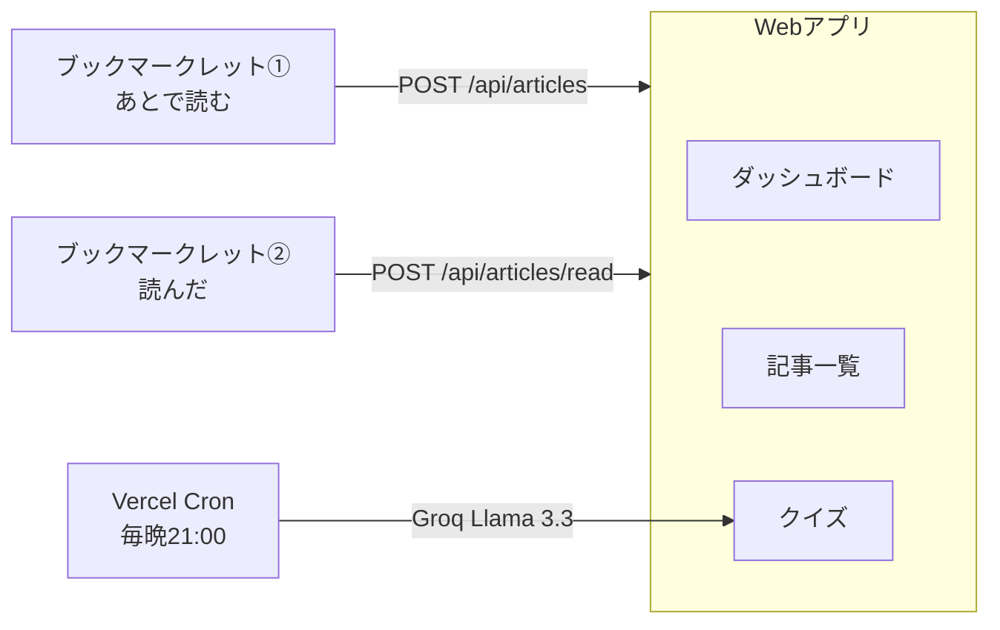

# BookmarkQuiz

> 技術記事を読んでも定着しない——そんな課題を解決するWebアプリ。
> ブックマークレットで記事を記録し、AIが生成したクイズで毎日復習する。

[](https://bookmarkquiz.vercel.app)
[](https://nextjs.org)
[](https://console.groq.com)

**→ https://bookmarkquiz.vercel.app**

GitHubアカウントがあればすぐ使えます。

---

## 使い方

1. **オンボーディング** — ブックマークレット2本をブックマークバーに追加
2. **あとで読む** — 気になる記事を開いたままブックマークレットをクリック（現在はQiita・Zennのみ対応）
3. **読んだ** — 記事を読み終わったらブックマークレットをクリック（現在はQiita・Zennのみ対応）
4. **記事一覧** — 未読・読んだ記事をダッシュボードから確認・管理できる
5. **クイズ** — 毎晩21時に読んだ記事からAIがクイズを自動生成、好きなタイミングで復習する

---

## アーキテクチャ



- ブックマークレットはChromeのブックマークバーに設置するJSボタン
- 「読んだ」はupsert — 記事未登録でもそのまま動く

---

## 技術スタック

| 領域 | 技術 |
|------|------|
| フレームワーク | Next.js 16 (App Router) |
| 認証 | Auth.js v5 (GitHub OAuth) |
| DB | Supabase (PostgreSQL) + Prisma |
| 本文取得 | Cheerio + fetch |
| クイズ生成 | Groq API (Llama 3.3 70B) |
| Cron | Vercel Cron Jobs |
| デプロイ | Vercel |

---

## ローカルで動かす

以下の外部サービスのアカウントとAPIキーが必要です。

| サービス | 用途 | 取得先 |
|----------|------|--------|
| Supabase | PostgreSQL DB | https://supabase.com |
| GitHub OAuth | ログイン認証 | https://github.com/settings/developers |
| Groq | クイズ生成AI | https://console.groq.com |

```bash
npm install
```

`.env` を作成:

```env
DATABASE_URL=          # Supabase の PostgreSQL 接続文字列
GITHUB_CLIENT_ID=      # GitHub OAuth App
GITHUB_CLIENT_SECRET=  # GitHub OAuth App
AUTH_SECRET=           # openssl rand -base64 32 で生成
GROQ_API_KEY=          # Groq API キー
CRON_SECRET=           # 任意の文字列（cronエンドポイントの認証用）
NEXT_PUBLIC_APP_URL=http://localhost:3000
```

```bash
npx prisma migrate deploy
npm run dev
```

---

## API

| メソッド | パス | 説明 |
|----------|------|------|
| POST | /api/articles | 「あとで読む」 |
| POST | /api/articles/read | 「読んだ」（upsert） |
| PATCH | /api/articles/[id] | ステータス切り替え |
| DELETE | /api/articles/[id] | 記事削除 |
| GET | /api/dashboard | 未読数・読んだ数 |
| GET | /api/quizzes | クイズ一覧（answer含まない） |
| POST | /api/quizzes/[id]/answer | 回答送信・正誤判定 |
| POST | /api/cron/generate-quizzes | クイズ生成（Vercel Cron） |
| POST | /api/token/reset | ブックマークレットトークン再発行 |

---

## DBスキーマ

<details>
<summary>展開して見る</summary>

### users
| カラム | 型 | 備考 |
|--------|-----|------|
| id | uuid | PK |
| name | string | |
| email | string | |
| bookmarklet_token | string | ブックマークレット認証用 |
| created_at | timestamp | |

### articles
| カラム | 型 | 備考 |
|--------|-----|------|
| id | uuid | PK |
| user_id | uuid | FK → users |
| url | string | unique(user_id, url) |
| title | string | |
| ogp_image | string | 外部URL |
| body_text | text | 全文（クイズ生成に使用） |
| status | enum | unread / done |
| read_at | timestamp | 「読んだ」押した日時 |
| created_at | timestamp | |

### quizzes
| カラム | 型 | 備考 |
|--------|-----|------|
| id | uuid | PK |
| article_id | uuid | FK → articles |
| question | text | |
| choices | json | 四択の選択肢配列 |
| answer | int | 正解のインデックス（0〜3） |
| explanation | text | |
| type | enum | daily / weekly |
| created_at | timestamp | |

### quiz_answers
| カラム | 型 | 備考 |
|--------|-----|------|
| id | uuid | PK |
| user_id | uuid | FK → users |
| quiz_id | uuid | FK → quizzes |
| is_correct | boolean | |
| answered_at | timestamp | |

</details>

---

## 今後の予定

- [ ] メール通知（カスタムドメイン取得後）
- [ ] 週次クイズ
- [ ] タグ機能
- [ ] ブラウザ拡張機能
