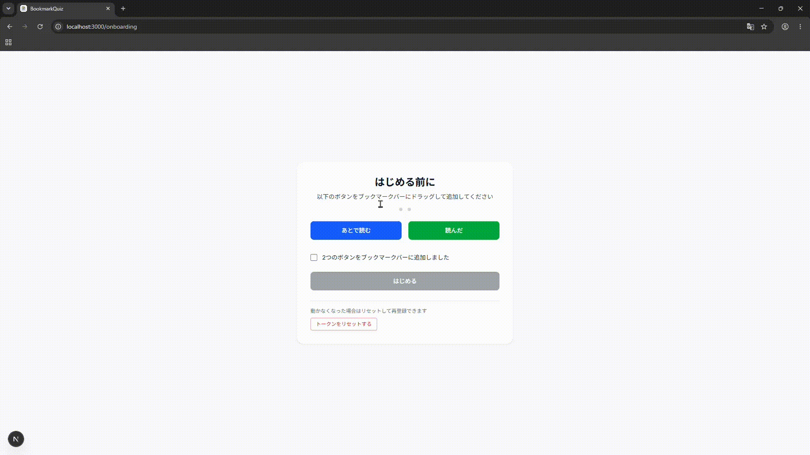
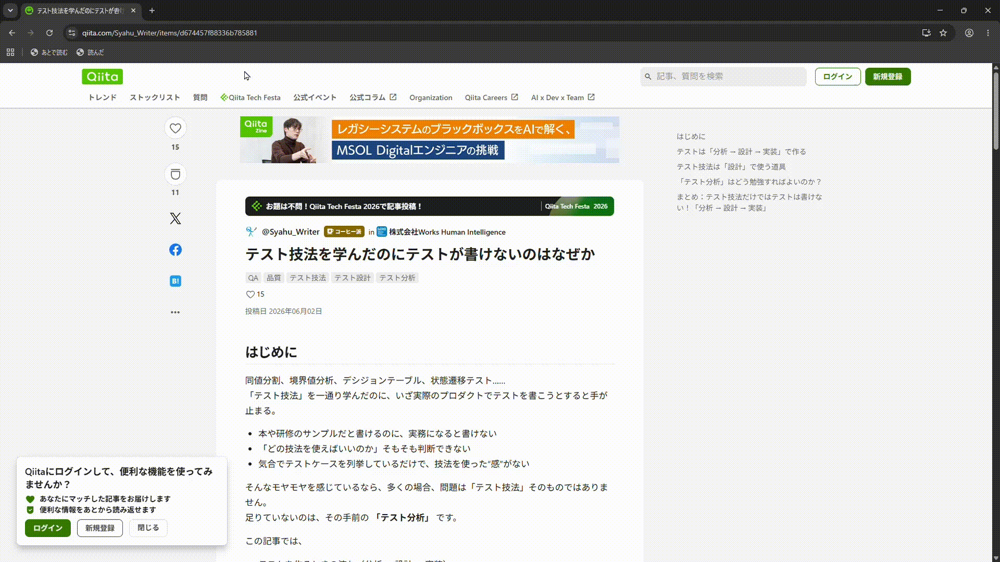
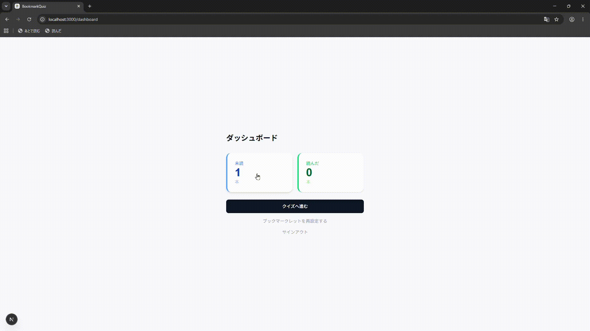
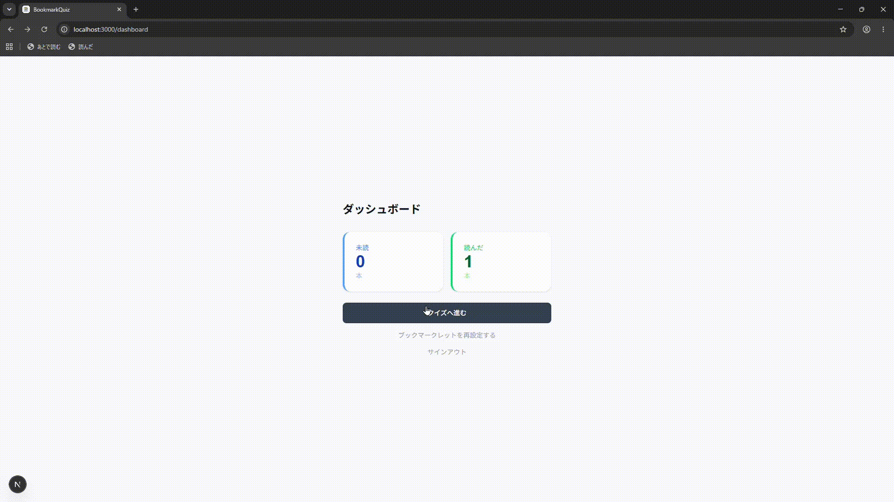
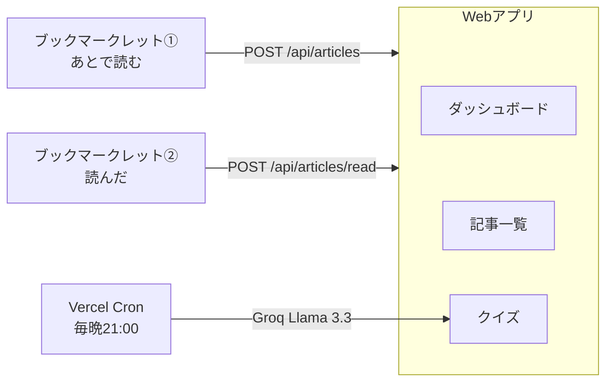

# BookmarkQuiz

> 技術記事を読んでも定着しない——そんな課題を解決するWebアプリ。
> ブックマークレットで記事を記録し、AIが生成したクイズで毎日復習する。

[](https://bookmarkquiz.vercel.app)
[](https://nextjs.org)
[](https://console.groq.com)

**→ https://bookmarkquiz.vercel.app**

GitHubアカウントがあればすぐ使えます。

---

## 使い方

1. **オンボーディング** — ブックマークレット2本をブックマークバーに追加
2. **あとで読む** — 気になる記事を開いたままブックマークレットをクリック（現在はQiita・Zennのみ対応）
3. **読んだ** — 記事を読み終わったらブックマークレットをクリック（現在はQiita・Zennのみ対応）
4. **記事一覧** — 未読・読んだ記事をダッシュボードから確認・管理できる
5. **クイズ** — 毎晩21時に読んだ記事からAIがクイズを自動生成、好きなタイミングで復習する

### セットアップ（ブックマークレットをドラッグ）



### あとで読む記事を管理する



### 読んだ記事を管理する



### クイズで復習する

毎晩21時、読んだ記事からAIが4択クイズを自動生成。好きなタイミングで回答すると、正誤判定と解説がその場で表示される。



---

## アーキテクチャ


```mermaid
flowchart LR
    BM1["ブックマークレット①\nあとで読む"] -->|POST /api/articles| WEB
    BM2["ブックマークレット②\n読んだ"] -->|POST /api/articles/read| WEB

    subgraph WEB["Webアプリ"]
        D[ダッシュボード]
        A[記事一覧]
        Q[クイズ]
    end

    CRON["Vercel Cron\n毎晩21:00"] -->|Groq Llama 3.3| Q
```

- ブックマークレットはChromeのブックマークバーに設置するJSボタン
- 「読んだ」はupsert — 記事未登録でもそのまま動く

---

## 技術スタック

| 領域 | 技術 |
|------|------|
| フレームワーク | Next.js 16 (App Router) |
| 認証 | Auth.js v5 (GitHub OAuth) |
| DB | Supabase (PostgreSQL) + Prisma |
| 本文取得 | Cheerio + fetch |
| クイズ生成 | Groq API (Llama 3.3 70B) |
| Cron | Vercel Cron Jobs |
| デプロイ | Vercel |

---

## ローカルで動かす

外部アカウント不要の **Docker** での起動を推奨します。本番に近い構成で試したい場合は Supabase を使う手順も用意しています。

まずリポジトリを取得して依存をインストール:

```bash
git clone https://github.com/endomasayaendo/bookmarkquiz.git
cd bookmarkquiz
npm install
```

### A. Docker でサクッと試す（おすすめ・外部アカウント不要）

ローカルの Docker Postgres ＋ 開発用ログイン（**Dev Login**）＋ デモデータ（シード）で動かすので、
**Supabase / GitHub OAuth / Groq のアカウントは一切不要**です。

**前提**: [Node.js](https://nodejs.org/)（18以上）と [Docker Desktop](https://www.docker.com/products/docker-desktop/) をインストールし、**Docker Desktop を起動しておく**こと。

#### 1. `.env` を作成

プロジェクト直下に `.env` ファイルを新規作成して、以下を貼り付けます。
（データベースは Docker のローカル DB が自動で使われるため、`.env` に DB の設定は不要です）

```env
AUTH_SECRET=xxxxxxxx                     # 任意の長い文字列。例: openssl rand -base64 32 で生成
NEXT_PUBLIC_APP_URL=http://localhost:3000
CRON_SECRET=dev
GITHUB_CLIENT_ID=dummy                   # Dev Login では使わないのでダミーでOK
GITHUB_CLIENT_SECRET=dummy
# GROQ_API_KEY=                          # 自分でクイズ生成を試すときだけ設定（任意）
```

#### 2. 起動

次の1コマンドで「Docker で Postgres 起動 → スキーマ作成 → デモデータ投入 → アプリ起動」までまとめて実行します。

```bash
npm run dev:fresh
```

#### 3. ブラウザで触る

`http://localhost:3000` を開き、ログイン画面の **「Dev Login（開発用）」** ボタンで入ります
（このボタンは開発時だけ表示されます）。

初回はオンボーディング画面が出ます。ブックマークレット2つをブックマークバーにドラッグして
「はじめる」を押すと、ダッシュボードに進みます。デモの記事・クイズが入っているので、
記事一覧からクイズ回答まで一通り試せます
（設置したブックマークレットは、実際の Qiita / Zenn の記事ページでそのまま使えます）。

---

**2回目以降**（Docker コンテナを起動したまま）は、これだけで起動できます:

```bash
npm run dev:local
```

**終了・後片付け**: `npm run db:test:down` でローカル DB を停止します（中のデータは消えます）。
また試すときは `npm run dev:fresh` を実行すれば、デモデータごと一式そろって起動します。

### B. Supabase で動かす（本番に近い構成）

実際のクラウド DB と GitHub ログインで動かす場合は、以下のアカウントとキーが必要です。

| サービス | 用途 | 取得先 |
|----------|------|--------|
| Supabase | PostgreSQL DB | https://supabase.com |
| GitHub OAuth | ログイン認証 | https://github.com/settings/developers |
| Groq | クイズ生成AI | https://console.groq.com |

```env
DATABASE_URL=          # Supabase の接続文字列（サーバーレス向けに Transaction pooler 推奨）
GITHUB_CLIENT_ID=      # GitHub OAuth App
GITHUB_CLIENT_SECRET=  # GitHub OAuth App
AUTH_SECRET=           # openssl rand -base64 32 で生成
GROQ_API_KEY=          # Groq API キー
CRON_SECRET=           # 任意の文字列（cronエンドポイントの認証用）
NEXT_PUBLIC_APP_URL=http://localhost:3000
```

```bash
npx prisma db push
npm run dev
```

---

## テスト

| 種類 | コマンド | 内容 |
|------|---------|------|
| ユニット/結合 | `npm test` | Vitest。`lib/` の関数と API ルートを検証（DB・fetch はモック） |
| E2E | `npm run test:e2e` | Playwright。実ブラウザでログイン〜オンボーディング・記事・クイズ回答まで通しで検証 |

E2E は本番 DB を汚さないよう、**Docker のローカル test 用 Postgres** に対して実行します（要 Docker Desktop）。
`npm run test:e2e` がコンテナ起動 → スキーマ投入 → テスト実行までを行います。後片付けは `npm run db:test:down`。
ログインは開発限定の Dev Login を使うため、E2E に GitHub アカウントは不要です。
CI（GitHub Actions）でも Postgres サービス上で同じ E2E が走ります。

---

## API

| メソッド | パス | 説明 |
|----------|------|------|
| POST | /api/articles | 「あとで読む」 |
| POST | /api/articles/read | 「読んだ」（upsert） |
| PATCH | /api/articles/[id] | ステータス切り替え |
| DELETE | /api/articles/[id] | 記事削除 |
| GET | /api/dashboard | 未読数・読んだ数 |
| POST | /api/onboarding/complete | オンボーディング完了 |
| GET | /api/quizzes | クイズ一覧（answer含まない） |
| POST | /api/quizzes/[id]/answer | 回答送信・正誤判定 |
| POST | /api/cron/generate-quizzes | クイズ生成（Vercel Cron） |
| POST | /api/cron/notify | メール通知（Vercel Cron） |
| POST | /api/token/reset | ブックマークレットトークン再発行 |

---

## DBスキーマ

<details>
<summary>展開して見る</summary>

### users
| カラム | 型 | 備考 |
|--------|-----|------|
| id | uuid | PK |
| name | string | |
| email | string | |
| bookmarklet_token | string | ブックマークレット認証用 |
| onboarding_completed | boolean | オンボーディング完了フラグ |
| created_at | timestamp | |

### articles
| カラム | 型 | 備考 |
|--------|-----|------|
| id | uuid | PK |
| user_id | uuid | FK → users |
| url | string | unique(user_id, url) |
| title | string | |
| ogp_image | string | 外部URL |
| body_text | text | 全文（クイズ生成に使用） |
| status | enum | unread / done |
| read_at | timestamp | 「読んだ」押した日時 |
| created_at | timestamp | |

### quizzes
| カラム | 型 | 備考 |
|--------|-----|------|
| id | uuid | PK |
| article_id | uuid | FK → articles |
| question | text | |
| choices | json | 四択の選択肢配列 |
| answer | int | 正解のインデックス（0〜3） |
| explanation | text | |
| type | enum | daily / weekly |
| created_at | timestamp | |

### quiz_answers
| カラム | 型 | 備考 |
|--------|-----|------|
| id | uuid | PK |
| user_id | uuid | FK → users |
| quiz_id | uuid | FK → quizzes |
| is_correct | boolean | |
| answered_at | timestamp | |

</details>

---

## 今後の予定

- [ ] メール通知（カスタムドメイン取得後）
- [ ] 週次クイズ
- [ ] タグ機能
- [ ] ブラウザ拡張機能
